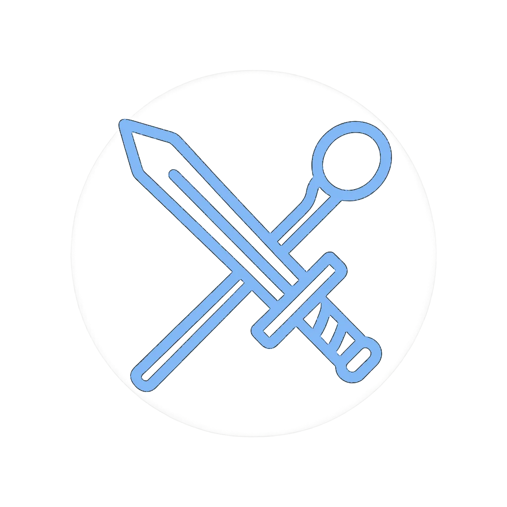

# Outrider's Pathfinder Projects 

Small, focused tools for Pathfinder 2e and Starfinder 2e play.
Each web tool is self-contained, so GMs and players can copy only what they need.

**Live site:** https://0utrider.github.io/pathfinder/

---

## Web Tools

- **[Challenge Point Calculator](challenge/index.html)** ([readme](challenge/README.md))
  Pathfinder Society (2e) scaling and difficulty, with a mobile-friendly layout.
- **[Downtime Calculator](downtime/index.html)** ([readme](downtime/readme.md))
  Pathfinder Society and Starfinder Society (2e) downtime income, with copy-to-clipboard summaries.
- **[Ledge Cover LOS](ledgecover/index.html)** ([readme](ledgecover/README.md))
  Pathfinder and Starfinder (2e) cover and line of sight when a ledge is involved.

All three share one look: light and dark themes (the choice is remembered across tools), a violet accent taken from the Outrider branding, and a clickable icon that returns to the landing page.

## Foundry VTT Modules

- **[Outrider's Web Tools](https://github.com/0utrider/outrider-web-tools)**
  Opens the web tools above in popup windows from Foundry VTT, with launcher macros.
- **[Outrider's Hero Points](https://github.com/0utrider/outrider-hero-points)**
  Configurable Hero Point rerolls for PF2e and SF2e, with a polished-metal Hero Die and Pass the Torch.
- **[Outrider's RNG](https://foundryvtt.com/packages/outrider-rng)**
  A better random number generator for dice rolls, using WebCrypto.

---

## About This Repository

Each tool lives in its own folder with its own assets, styles, and documentation.
The root directory holds the landing page, shared branding (the logo and favicons), and this readme.

To use a single tool, copy its folder into your own project. No parent-level dependencies are required.
The Buy Me a Coffee footer loads from the hosted site and is optional.

---

***Did you find this useful? [ **Buy Me a Coffee!**](https://buymeacoffee.com/outrider)***

---

## License

GNU Public License.
Feel free to fork, modify, and build on these tools for your own tables.
